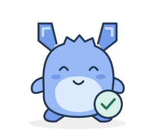
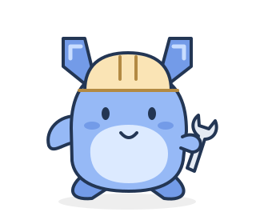

<p align="center">
  
</p>

<h1 align="center">
  
  Terrence
</h1>

<p align="center">
  <strong>Big plans. Steady hands.</strong><br/>
  A self-hosted Terraform and OpenTofu run platform.<br/>
  Manage plans, applies, state, and policies on infrastructure you control.
</p>

<p align="center">
  <a href="https://github.com/essinghigh-org/terrence/blob/master/LICENSE"></a>
  <a href="https://github.com/essinghigh-org/terrence/pkgs/container/terrence"></a>
  
</p>

<p align="center">
  <a href="#quick-start">Quick start</a> ·
  <a href="backend/docs/">Documentation</a> ·
  <a href="#development">Development</a> ·
  <a href="#meet-terrence">Meet Terrence</a>
</p>

## Features

- Workspace management with run history and locking
- Terraform and OpenTofu remote runs
- Plan review and controlled applies
- State storage and version history
- Workspace variables and variable sets
- Sentinel and OPA policy checks
- VCS integration (GitHub, GitLab, Bitbucket)
- SSO support (SAML, OIDC, LDAP)
- Private module registry
- Run tasks and notifications
- Agent pools and cloud workload identity
- Team and role-based access control

## Quick start

### Docker

```bash
mkdir -p ./storage && sudo chown 65532:65532 ./storage

docker run -d --name terrence -p 3000:3000 \
  -e ADMIN_PASSWORD="pick-a-long-password" \
  -v ./storage:/app/backend/storage \
  ghcr.io/essinghigh-org/terrence:latest
```

For dogfooding the current `master` build, use the rolling nightly image instead:

```bash
docker pull ghcr.io/essinghigh-org/terrence:nightly
docker run -d --name terrence -p 3000:3000 \
  -e ADMIN_PASSWORD="pick-a-long-password" \
  -v ./storage:/app/backend/storage \
  ghcr.io/essinghigh-org/terrence:nightly
```

The `:nightly` tag is rebuilt after every successful commit to `master`. It is
intended for testing current changes and can change independently of versioned
releases.

Open `http://localhost:3000` and sign in as `admin` using the password you configured.

That is plain HTTP for local use. For `terraform login` and anything beyond localhost, terminate TLS first: [Reverse proxy (HTTPS)](backend/docs/reverse-proxy.md).

### Docker Compose

```bash
git clone https://github.com/essinghigh-org/terrence.git
cd terrence
ADMIN_PASSWORD="pick-a-long-password" docker compose up -d
```

## Development

Requirements:

- Bun 1.4.0
- Terraform >= 1.9 or OpenTofu >= 1.7

```bash
bun install
(cd frontend && bun run build)
(cd backend && bun run index.ts)
```

## Documentation

Full documentation is available in [`backend/docs/`](backend/docs/) or inside a running Terrence instance under the Documentation section.

## Compatibility

Terrence supports the official `hashicorp/tfe` Terraform provider and the Terraform/OpenTofu remote workflows it implements. The provider surface is tracked against an explicit released provider version and continuously exercised by end-to-end tests.

General Terraform Enterprise or HCP Terraform API and feature parity is not a goal. An endpoint documented by TFE is not automatically part of Terrence.

## Meet Terrence

Our infrastructure companion has bracket-shaped ears, a blue coat, and a few tools for the job. You'll meet Terrence on the sign-in page, in introductory guides, and when a workspace needs a next step.

<p align="center">
  
  
  
</p>

The [seven SVG poses](frontend/public/brand/) share one character and palette. The [brand guide](frontend/src/components/brand/README.md) covers illustration placement, typography, spacing, and regenerating the assets. If you're contributing to the UI, reuse the shared character and controls to keep Terrence consistent.

## License

MIT — see [LICENSE](LICENSE).
